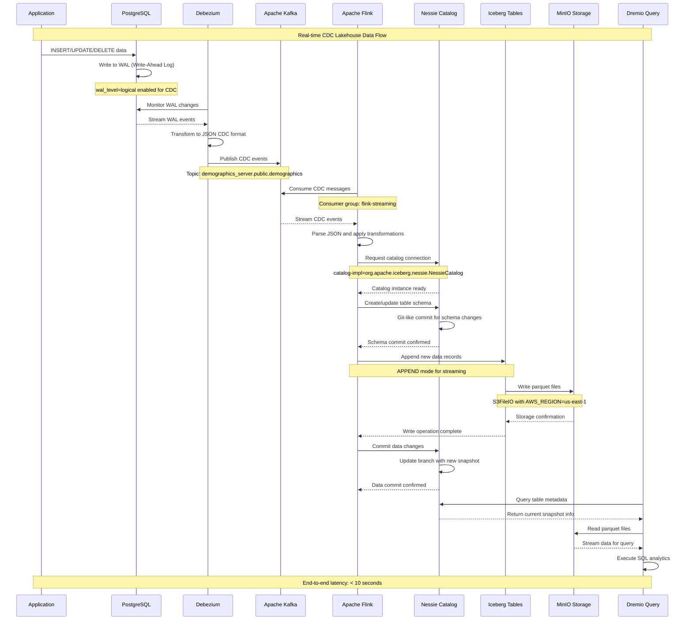
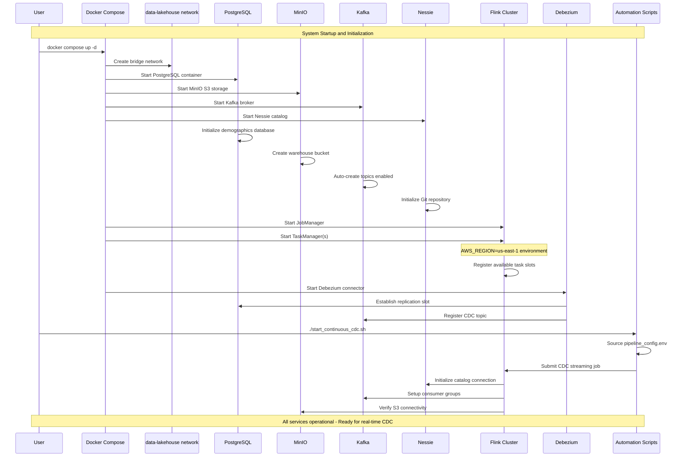
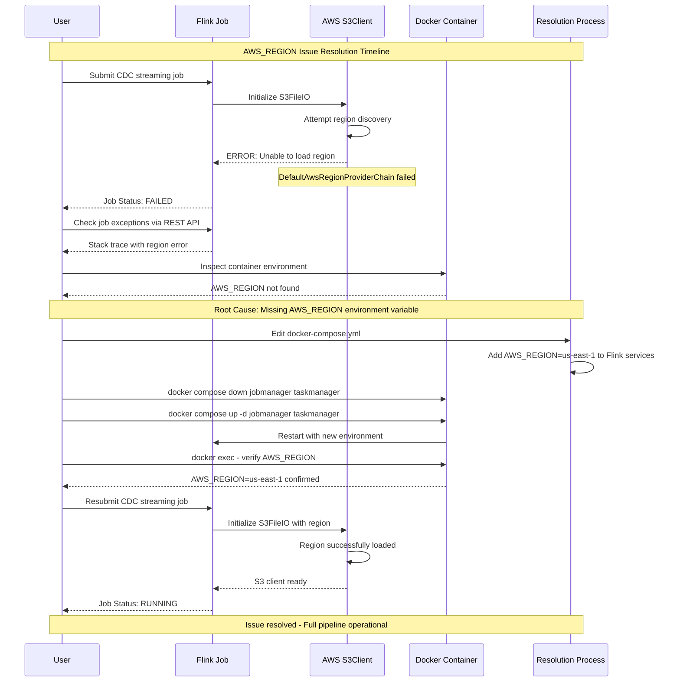
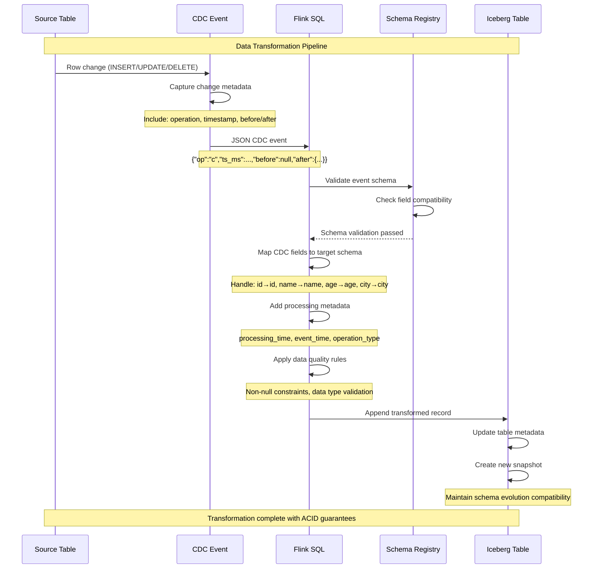
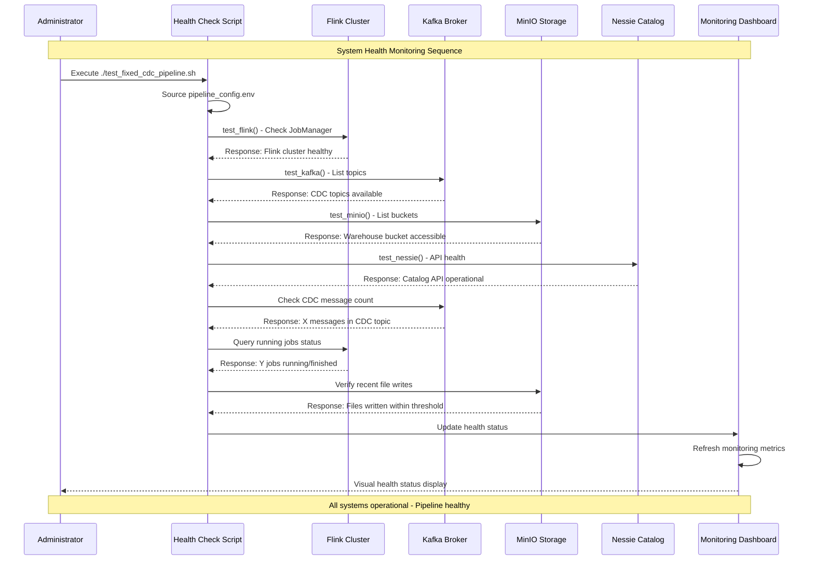

# Nessie CDC Lakehouse - Sequence Diagrams

## 🔄 **Primary Data Flow Sequence**

### **Real-time CDC Processing Pipeline**

---

## 🚀 **System Startup Sequence**

### **Container Orchestration and Service Dependencies**

---

## 🛠️ **Troubleshooting Sequence - AWS_REGION Issue**

### **Problem Diagnosis and Resolution**

---

## 📊 **Data Transformation Sequence**

### **CDC Event Processing and Schema Evolution**

---

## 🔧 **Monitoring and Health Check Sequence**

### **System Health Validation Flow**

---

## 💡 **Key Sequence Patterns**

### **Critical Success Factors**

1. **Dependency Order**: PostgreSQL → Kafka → Flink → Nessie → MinIO
2. **Environment Setup**: AWS_REGION must be set before S3FileIO initialization
3. **Catalog Syntax**: Use `catalog-impl` not `catalog-type` for Nessie
4. **Consumer Groups**: Proper Kafka consumer group management for exactly-once processing
5. **Health Checks**: Sequential validation of each component before pipeline start

### **Error Recovery Patterns**

1. **Job Failure**: Flink checkpointing enables automatic restart from last consistent state
2. **Connection Loss**: Kafka consumer offset management ensures no data loss
3. **Storage Issues**: MinIO redundancy and Iceberg metadata versioning provide durability
4. **Schema Changes**: Nessie branching allows safe schema evolution with rollback capability

### **Performance Optimization**

1. **Parallel Processing**: Flink parallelism configuration matches available task slots
2. **Batch Optimization**: Iceberg commit interval balances latency vs. efficiency
3. **Network Efficiency**: Container-to-container communication via internal network
4. **Resource Management**: Docker resource limits prevent service interference

---

**🎯 Sequence Flow Summary**: Complete end-to-end real-time CDC pipeline with comprehensive monitoring, error handling, and performance optimization patterns. 